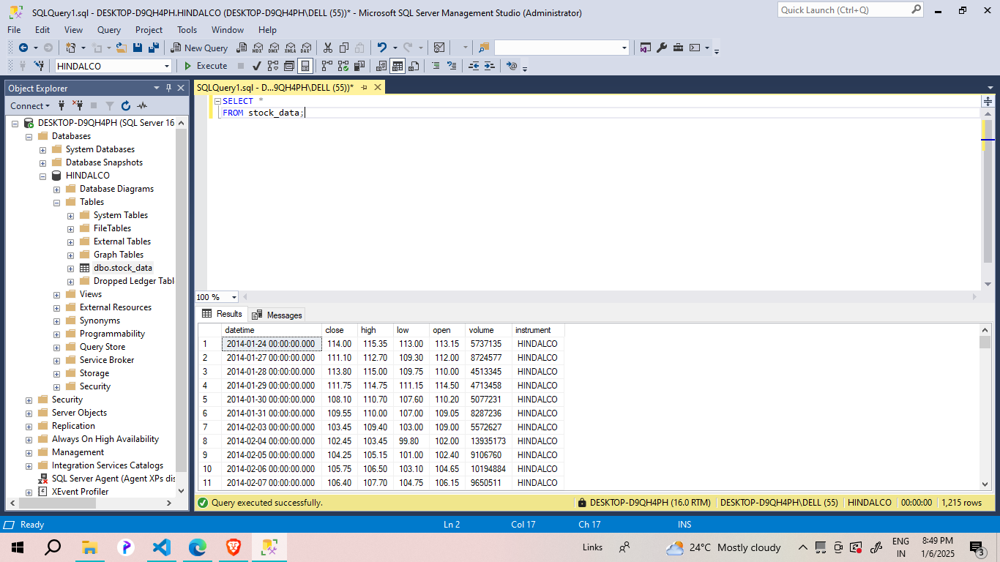
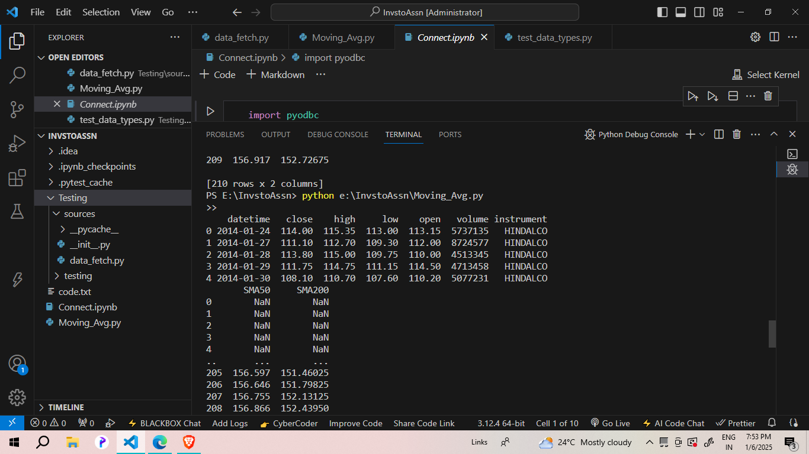
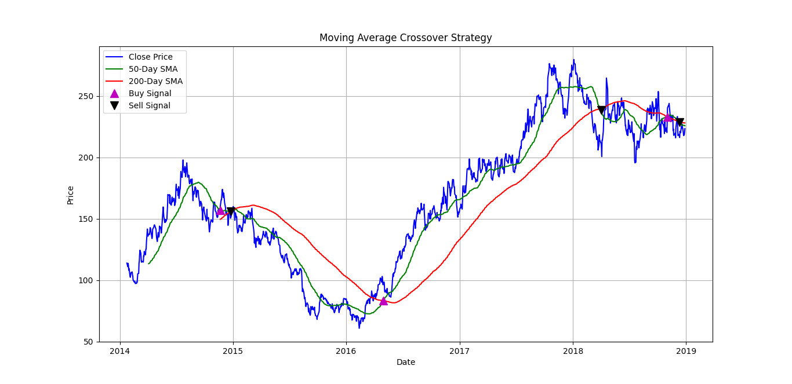
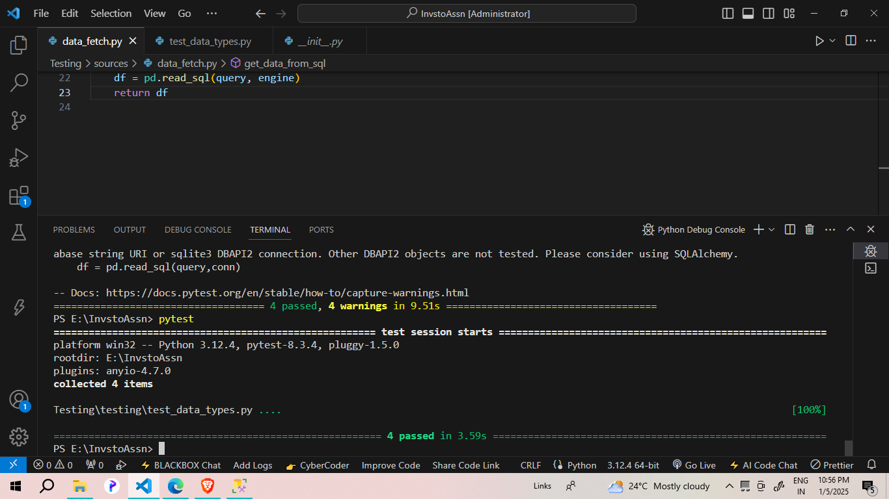
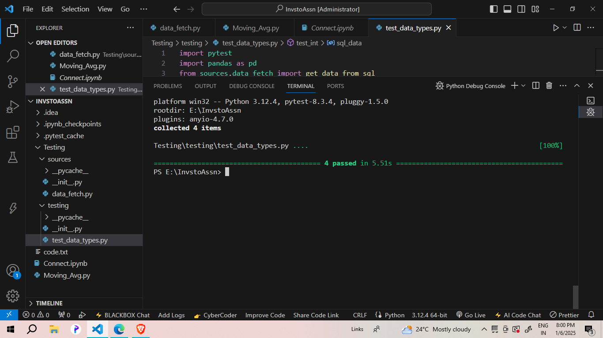

# Stock_Data_Analysis_using_Python

<h1>Stock Data Analysis</h1>

For my stock data analysis project using Python, the assignment involves three main steps. First, I need to create a table in an MS SQL Server database and insert data for one ticker symbol into this table using Python. This involves setting up the database connection in MS SQL Server Management Studio and ensuring the data is successfully inserted. Second, I will analyze the data using Python and create an investing or trading strategy. The recommended strategy for those unfamiliar is the simple moving average (SMA) crossover strategy, which identifies potential buy and sell signals based on the crossover of short-term and long-term moving averages. Finally, I will submit the results of how my strategy is performing. To ensure data integrity, I will write a unit testing module with pytest to validate that the input data meets specified criteria: the Open, High, Low, and Close columns should be decimals, the Volume column should be an integer, the Instrument column should be a string, and the Datetime column should be a datetime type. By completing these steps, I aim to effectively demonstrate my ability to handle, test, and analyze stock data using Python and MS SQL Server.

   

    <h1>I.Inserting Data into MS SQL Server Using Python</h1>
    

        This project demonstrates how to insert stock data into an MS SQL Server database using Python and the `pyodbc` library. The process involves establishing a connection to the database, reading data from an Excel file, creating a table in the database, and inserting the data into the table. Below are the steps in detail:
    

    
  <h2>Steps</h2>
    <ol>
        <li>
            <strong>Import Libraries:</strong>
            
First, import the required libraries, `pyodbc` for database connection and `pandas` for data manipulation.

            <pre><code>import pyodbc
import pandas as pd
            </code></pre>
        </li>
        <li>
            <strong>List Available Drivers:</strong>
            
Check the available ODBC drivers on your system to ensure the correct driver is installed.

            <pre><code>pyodbc.drivers()</code></pre>
        </li>
        <li>
            <strong>Establish a Connection:</strong>
            
Establish a connection to the MS SQL Server database using the `ODBC Driver 17 for SQL Server` and Windows Authentication.

            <pre><code>conn = pyodbc.connect(
    Trusted_Connection = "Yes",
    Driver = '{ODBC Driver 17 for SQL Server}',
    Server = "DESKTOP-D9QH4PH",
    Database = "HINDALCO"
)
cursor = conn.cursor()
            </code></pre>
        </li>
        <li>
            <strong>Read Data from Excel:</strong>
            
Read the stock data from an Excel file into a pandas DataFrame.

            <pre><code>df = pd.read_excel(r'C:\Users\DELL\Downloads\HINDALCO_1D.xlsx')
df.head()
df.columns
            </code></pre>
        </li>
        <li>
            <strong>Create Table in Database:</strong>
            
Execute an SQL command to create a table named `stock_data` in the `HINDALCO` database with the required columns and data types.

            <pre><code>cursor.execute("""
    CREATE TABLE stock_data (
        [datetime] DATETIME,
        [close] DECIMAL(10,2),
        [high] DECIMAL(10,2),
        [low] DECIMAL(10,2),
        [open] DECIMAL(10,2),
        [volume] INT,
        [instrument] VARCHAR(50)
    )
""")
            </code></pre>
        </li>
        <li>
            <strong>Insert Data into the Table:</strong>
            
Loop through each row in the DataFrame and execute an SQL `INSERT` statement to add the data to the `stock_data` table.

            <pre><code>for row in df.itertuples(index=False):
    cursor.execute("""
        INSERT INTO HINDALCO.dbo.stock_data (datetime, [close], high, low, [open], volume, instrument)
        VALUES(?,?,?,?,?,?,?)""",
        (row.datetime,
        row.close,
        row.high,
        row.low,
        row.open,
        row.volume,
        row.instrument,
        )
    )
conn.commit()
            </code></pre>
        </li>
        <li>
            <strong>Close the Connection:</strong>
            
Finally, close the connection to the database.

            <pre><code>conn.close()</code></pre>
        </li>
    </ol>
<h2>Screenshots of Output</h2>

1.Screenshot of the query of the Database in the Microsoft SQL server studio management

   

    
<h1>II.Simple Moving Average Crossover Strategy</h1>

        This project demonstrates how to implement a Simple Moving Average (SMA) crossover strategy using Python. The data is fetched from an SQL database, and the analysis includes calculating moving averages, generating trading signals, and visualizing the results. The `get_data_from_sql` function, used to fetch data, is imported from the `Testing.sources.data_fetch` module. Here's the detailed process:

<h2>Steps</h2>
    <ol>
        <li>
            <strong>Import Libraries:</strong>
            
First, import the required libraries for data manipulation, analysis, and visualization.

            <pre><code>import pandas as pd
import numpy as np
import matplotlib.pyplot as plt
from sqlalchemy import create_engine
from Testing.sources.data_fetch import get_data_from_sql
            </code></pre>
        </li>
        <li>
            <strong>Fetch Data from SQL:</strong>
            
Use the `get_data_from_sql` function to fetch stock data from the SQL database.

            <pre><code>df = get_data_from_sql()
print(df.head())
            </code></pre>
        </li>
        <li>
            <strong>Calculate Moving Averages:</strong>
            
Calculate the 50-day and 200-day Simple Moving Averages (SMA) and add them as new columns in the DataFrame.

            <pre><code>df['SMA50'] = df['close'].rolling(window=50).mean()
df['SMA200'] = df['close'].rolling(window=200).mean()
print(df[['SMA50','SMA200']].head(210))
            </code></pre>
        </li>
        <li>
            <strong>Generate Trading Signals:</strong>
            
Create a `Signal` column to indicate buy signals (1) and sell signals (0) based on the SMA crossover. Use the `Position` column to track changes in signals.

            <pre><code>df['Signal'] = 0 
df['Signal'][50:] = np.where(df['SMA50'][50:] > df['SMA200'][50:], 1, 0)
df['Position'] = df['Signal'].diff()
print("DataFrame with Trading Signals:") 
print(df[['datetime', 'close', 'SMA50', 'SMA200', 'Signal', 'Position']].tail(10))
            </code></pre>
        </li>
        <li>
            <strong>Plot Moving Averages and Signals:</strong>
            
Visualize the close price, SMAs, and trading signals using matplotlib.

            <pre><code>plt.figure(figsize=(14,7)) 
plt.plot(df['datetime'], df['close'], label='Close Price', color='blue') 
plt.plot(df['datetime'], df['SMA50'], label='50-Day SMA', color='green') 
plt.plot(df['datetime'], df['SMA200'], label='200-Day SMA', color='red') 
plt.plot(df[df['Position'] == 1]['datetime'], df['SMA50'][df['Position'] == 1], '^', markersize=10, color='m', lw=0, label='Buy Signal') 
plt.plot(df[df['Position'] == -1]['datetime'], df['SMA50'][df['Position'] == -1], 'v', markersize=10, color='k', lw=0, label='Sell Signal') 
plt.title('Moving Average Crossover Strategy') 
plt.xlabel('Date') 
plt.ylabel('Price') 
plt.legend() 
plt.grid() 
plt.show()
            </code></pre>
        </li>
    </ol>

<h2>Screenshots of Output</h2>

Below are the screenshots of the output generated by the Simple Moving Average crossover strategy:

Screenshot 1: Data Fetching and Head of DataFrame

    

Screenshot 2: Moving Averages and Trading Signals in Graphs

    <body>
    <h1>III.Unit Testing for Stock Data Validity and Simple Moving Average Analysis</h1>
    

        This section demonstrates the unit tests created to validate the stock data and analyze the Simple Moving Average (SMA) crossover strategy. The data is fetched from the SQL database, and several tests are performed to ensure the data's integrity. Additionally, we used SQLAlchemy for better pandas support, as using `pyodbc` generated warnings. Below are the steps and explanations:
    

    
<h2>Data Fetching</h2>
    

        Initially, we used `pyodbc` for database connection, but it generated the following warning with respect to the screenshot of the test cases passed but showing warnings:
    

    <blockquote>
        
UserWarning: pandas only supports SQLAlchemy connectable (engine/connection) or database string URI or sqlite3 DBAPI2 connection. Other DBAPI2 objects are not tested. Please consider using SQLAlchemy.

    </blockquote>
    
Here is the screenshot of the test cases passed but showing warnings:

    
    

        To resolve this, we switched to using SQLAlchemy for the database connection:
    

    <pre><code>from sqlalchemy import create_engine
import pandas as pd

def get_data_from_sql(): 
    engine = create_engine('mssql+pyodbc://DESKTOP-D9QH4PH/HINDALCO?driver=ODBC+Driver+17+for+SQL+Server', fast_executemany=True) 
    query = "SELECT * FROM stock_data" 
    df = pd.read_sql(query, engine) 
    return df
    </code></pre>
    
Here is the screenshot of the test cases passed without any warnings:

    
    
<h2>Unit Testing with Pytest</h2>
    

        The unit testing module uses `pytest` to validate the integrity of the data fetched from the SQL database. The tests ensure that the data types for each column are correct. Below are the specific tests performed:
    

    <ol>
        <li>
            <strong>Test Datetime Column:</strong>
            
Check if the 'datetime' column is of datetime type.

            <pre><code>def test_datetime(sql_data):
    df = sql_data
    assert pd.api.types.is_datetime64_any_dtype(df['datetime']), "datetime column is not of datetime type"
            </code></pre>
        </li>
        <li>
            <strong>Test Decimal Columns:</strong>
            
Check if the 'open', 'high', 'low', and 'close' columns are of decimal type.

            <pre><code>def test_decimal(sql_data):
    df = sql_data
    for col in ['open','high','low','close']:
        assert pd.api.types.is_float_dtype(df[col]), f"{col} column is not of decimal type"
            </code></pre>
        </li>
        <li>
            <strong>Test String Column:</strong>
            
Check if the 'instrument' column is of string type.

            <pre><code>def test_string(sql_data):
    df = sql_data
    assert pd.api.types.is_string_dtype(df['instrument']), "Instrument column is not of string type"
            </code></pre>
        </li>
        <li>
            <strong>Test Integer Column:</strong>
            
Check if the 'volume' column is of integer type.

            <pre><code>def test_int(sql_data):
    df = sql_data
    assert pd.api.types.is_integer_dtype(df['volume']), "Volume column is not of integer type"
            </code></pre>
        </li>
    </ol>

   

    <body>
    <h1>IV.Conclusion</h1>
    

        In this project, we have demonstrated a comprehensive approach to analyzing stock data using Python. From establishing a secure database connection and inserting data into MS SQL Server, to performing unit tests with `pytest` to ensure data integrity, and finally implementing and analyzing a Simple Moving Average (SMA) crossover strategy. By following these steps, we've ensured our data is accurate and our trading strategy is well-validated. This repository serves as a robust example of how Python can be used effectively for financial data analysis and strategy development.
    

    

        Thank you for taking the time to explore this repository. Your interest and engagement are greatly appreciated. We hope this project provides valuable insights and serves as a useful reference for your future endeavors in data analysis and algorithmic trading. If you have any questions or feedback, please feel free to reach out.
    

</body>

